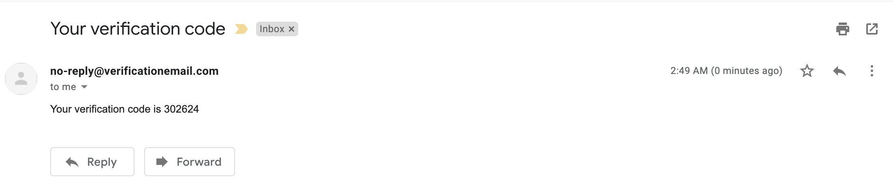

## React App Using AWS Amplify

POC to understand how to work with AWS Managed GraphQL service i.e., [AWS AppSync](https://aws.amazon.com/appsync/)

This project has been bootstrapped with [Create React App](https://github.com/facebook/create-react-app) and [AWS Amplify](https://aws.amazon.com/amplify/)

Detail instruction can be found here on [AWS Amplify Docs](https://docs.amplify.aws/start/getting-started/setup/q/integration/react)

## Output of Key Setup Steps
### Add API

### Add Auth

### Add Hosting

## Demo
### Run Demo
#### In Local (without auth)
- `npm start` (to test with local mock `amplify mock api` first )


##### Add a new ToDo


##### View All ToDo(s)


##### GraphQL ToDo API


##### DynampDB ToDo Table


### Via S3 Website
- `amplify add auth` (ignore if alredy done)
- `amplify add hosting` (ignore if alredy done)
- `amplify publish`
- `npm install -g serve && serve -s build` (to test local with build version) 

##### Sign In Page


##### Create New Account Page


##### Verification code to complete registration



##### New User Created in Cognito


##### Sign with new user


##### Secure Home Page


## Issues faced

After adding hosting by `amplify add hosting` when `amplify publish` was run below error occured
```
npm WARN build `npm build` called with no arguments. Did you mean to `npm run-script build`?
frontend build command exited with code 0
Publish started for S3AndCloudFront

Cannot find the distribution folder.
Distribution folder is currently set as:
  /Users/subratamazumder/workspace/react-amplified/build

Cannot find the distribution folder.
Error: Cannot find the distribution folder.
    at Object.scan (/usr/local/lib/node_modules/@aws-amplify/cli/node_modules/amplify-category-hosting/lib/S3AndCloudFront/helpers/file-scanner.js:38:11)
```

This seems to be a bug, fix is to run `npm run build` to create missing `build` directory.
I have raise this as a [bug](https://github.com/aws-amplify/amplify-cli/issues/5363). 
## Available Scripts

In the project directory, you can run:

### `npm start`

Runs the app in the development mode.<br />
Open [http://localhost:3000](http://localhost:3000) to view it in the browser.

The page will reload if you make edits.<br />
You will also see any lint errors in the console.

### `npm test`

Launches the test runner in the interactive watch mode.<br />
See the section about [running tests](https://facebook.github.io/create-react-app/docs/running-tests) for more information.

### `npm run build`

Builds the app for production to the `build` folder.<br />
It correctly bundles React in production mode and optimizes the build for the best performance.

The build is minified and the filenames include the hashes.<br />
Your app is ready to be deployed!

See the section about [deployment](https://facebook.github.io/create-react-app/docs/deployment) for more information.

### `npm run eject`

**Note: this is a one-way operation. Once you `eject`, you can’t go back!**

If you aren’t satisfied with the build tool and configuration choices, you can `eject` at any time. This command will remove the single build dependency from your project.

Instead, it will copy all the configuration files and the transitive dependencies (webpack, Babel, ESLint, etc) right into your project so you have full control over them. All of the commands except `eject` will still work, but they will point to the copied scripts so you can tweak them. At this point you’re on your own.

You don’t have to ever use `eject`. The curated feature set is suitable for small and middle deployments, and you shouldn’t feel obligated to use this feature. However we understand that this tool wouldn’t be useful if you couldn’t customize it when you are ready for it.

## Learn More

You can learn more in the [Create React App documentation](https://facebook.github.io/create-react-app/docs/getting-started).

To learn React, check out the [React documentation](https://reactjs.org/).

### Code Splitting

This section has moved here: https://facebook.github.io/create-react-app/docs/code-splitting

### Analyzing the Bundle Size

This section has moved here: https://facebook.github.io/create-react-app/docs/analyzing-the-bundle-size

### Making a Progressive Web App

This section has moved here: https://facebook.github.io/create-react-app/docs/making-a-progressive-web-app

### Advanced Configuration

This section has moved here: https://facebook.github.io/create-react-app/docs/advanced-configuration

### Deployment

This section has moved here: https://facebook.github.io/create-react-app/docs/deployment

### `npm run build` fails to minify

This section has moved here: https://facebook.github.io/create-react-app/docs/troubleshooting#npm-run-build-fails-to-minify
